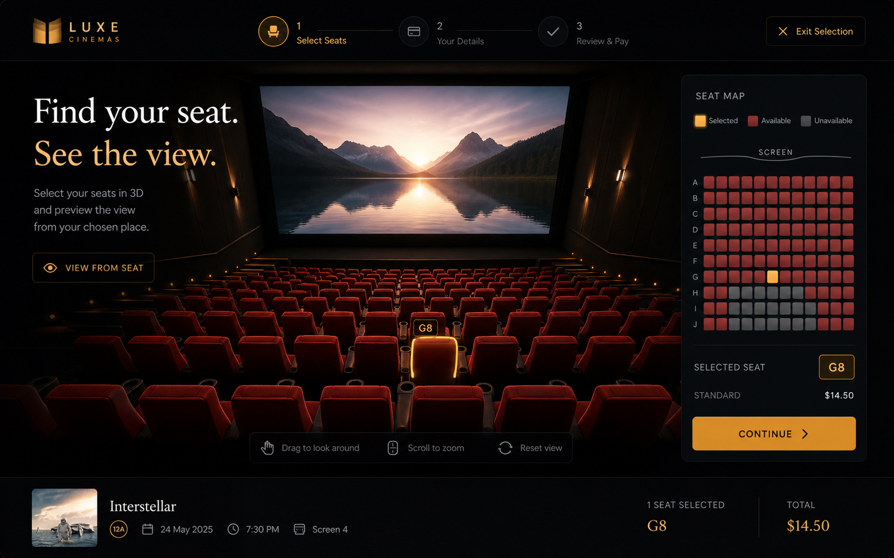

# Cinema 3D Seat Selection

An interactive 3D cinema seat picker built with [Three.js](https://threejs.org/) and Vite.

## What it does

- Renders a stylized cinema auditorium in 3D
- Lets you preview seats from their actual viewpoint
- Shows an interactive seat map with occupied, available, and selected states
- Includes a booking card and confirmation toast for the selected seat

## Preview



## Run locally

```bash
npm install
npm run dev
```

## Build

```bash
npm run build
```
